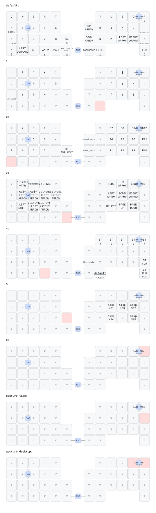

# zmk-config-moNa2



## 現在のキーマップ

文字キーは通常のQWERTY配列です。`A`や`Z`の長押しには別の機能を割り当てていません。
Shift、Control、Command、Optionは左下と右端に独立して配置しています。

### 親指キー

| 側 | キー |
| --- | --- |
| 左 | Backspace、Enter、英数 |
| 右 | かな、Space |

### レイヤーの開き方

レイヤーキーは、押している間だけ有効です。キーを離すと通常の文字入力へ戻ります。

| レイヤー | 押し続けるキー | 用途 |
| --- | --- | --- |
| Layer 1 | `H`の左隣にある中央キー | 数字と記号 |
| Layer 2 | `N`の左隣にある中央キー | 矢印、Macの画面操作、ファンクションキー |
| Layer 3 | `B`の右隣にある中央キー | トラックボールのスクロールとマウスボタン |
| Layer 4 | Layer 3を開き、右親指のSpace位置を押す | Bluetooth接続先の選択と消去 |

Layer 4へ移動すると、その状態が維持されます。通常の文字入力へ戻るには、右親指のSpace位置をもう一度押してください。
英数とかなの同時長押しでもLayer 4を一時的に開けます。同じ2キーを短く押した場合は、Escとして動作します。

### 矢印キー

`N`の左隣にあるLayer 2キーを押しながら、次のキーを押します。

| キー | 動作 |
| --- | --- |
| `I` | 上矢印 |
| `J` | 左矢印 |
| `K` | 下矢印 |
| `L` | 右矢印 |

### Macの画面操作

次の操作も、Layer 2キーを押しながら実行します。

| キー | Macで実行する操作 | 何ができるか |
| --- | --- | --- |
| `E` | スクリーンショット | 範囲を選択して画面を撮影する |
| `R` | Mission Control | 開いているすべてのウインドウとデスクトップを一覧表示する |
| `T` | App Exposé | 現在使用しているアプリのウインドウだけを一覧表示する |
| `A` | Command＋左矢印 | 文章の現在行の先頭へ移動する |
| `S` | Command＋右矢印 | 文章の現在行の末尾へ移動する |
| `D` | Option＋左矢印 | 文章内を単語単位で左へ移動する |
| `F` | Option＋右矢印 | 文章内を単語単位で右へ移動する |

トラックパッドの3本指左右スワイプに相当する「デスクトップを左右へ切り替える操作」は、現在のキーマップには割り当てていません。

### トラックボールでスクロールする

`B`の右隣にあるLayer 3キーを押した状態で、トラックボールを動かしてください。

| トラックボールの方向 | 動作 |
| --- | --- |
| 上下 | 画面を縦方向へスクロール |
| 左右 | 画面を横方向へスクロール |

Layer 3キーを押した状態では、左手側のキーをマウスボタンとして使用できます。

| キー | 動作 |
| --- | --- |
| `F` | 左クリック |
| `D` | 右クリック |
| `S` | 中央クリック |

トラックボールはボールの移動量と方向を検出します。指の本数やボールへのタップは検出できないため、トラックパッドと同じ2本指・3本指ジェスチャーには対応していません。

## COROPITを使用する場合

COROPITを使用する方は以下のようにコードを編集してください。

mona2_r.overlay

修正前
```
  trackball_central: trackball_central@0 {
        status = "okay";
        compatible = "pixart,pmw3610";  //トラボセンサ用のドライバとバインド
        reg = <0>;
        spi-max-frequency = <2000000>;
        irq-gpios = <&gpio0 2 (GPIO_ACTIVE_LOW | GPIO_PULL_UP)>; //P0.02を指定(MOTION)
        cpi = <600>;
        //swap-xy;
        //invert-x; //COROPIT版ではコメントアウトを外す
        //invert-y; //COROPIT版ではコメントアウトを外す
        evt-type = <INPUT_EV_REL>;
        x-input-code = <INPUT_REL_X>;
        y-input-code = <INPUT_REL_Y>;
    };
};

```
**修正後**
```
  trackball_central: trackball_central@0 {
        status = "okay";
        compatible = "pixart,pmw3610";  //トラボセンサ用のドライバとバインド
        reg = <0>;
        spi-max-frequency = <2000000>;
        irq-gpios = <&gpio0 2 (GPIO_ACTIVE_LOW | GPIO_PULL_UP)>; //P0.02を指定(MOTION)
        cpi = <600>;
        //swap-xy;
        invert-x; //COROPIT版ではコメントアウトを外す
        invert-y; //COROPIT版ではコメントアウトを外す
        evt-type = <INPUT_EV_REL>;
        x-input-code = <INPUT_REL_X>;
        y-input-code = <INPUT_REL_Y>;
    };
};

```
